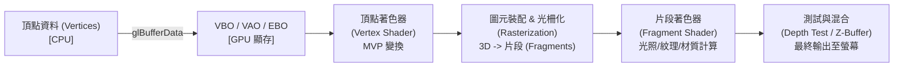

# OpenGL Learning Journey


-0078D6?style=flat-square&logo=windows)

本專案記錄了我跟隨網路教學（包含知名教學 [LearnOpenGL](https://learnopengl.com/) 以及 [Lazy Foo' Productions](https://lazyfoo.net/tutorials/OpenGL/)）自主學習電腦圖形學與 OpenGL 的完整實作軌跡。

從早期 **OpenGL 2.1 固定管線 (Fixed-Function Pipeline)** 的矩陣堆疊與即時模式，全面過渡至 **OpenGL 3.3+ 核心模式 (Programmable Pipeline / Core Profile)**，逐步實現自定義著色器、現代緩衝物件、3D 矩陣轉換、FPS 漫遊攝影機以及完整的馮氏光照與多光源系統。

---

## 核心特色與學習脈絡

- **跨越世代的圖形學體會**：
  - **經典管線 (Legacy OpenGL)**：體驗 `glBegin` / `glEnd`、矩陣堆疊（`glPushMatrix` / `glPopMatrix`）以及視口操作，理解傳統繪圖架構的限制。
  - **現代管線 (Modern OpenGL 3.3+)**：深入 GPU 可程式化渲染管線（Programmable Pipeline），親手編寫 GLSL 著色器，操作 VAO / VBO / EBO 與 GPU 顯存互動。
- **扎實的 3D 數學與座標轉換**：
  - 完整走過 3D 空間管線：$\text{Local Space} \to \text{World Space} \to \text{View Space} \to \text{Clip Space} \to \text{Screen Space}$。
  - 使用 GLM 庫建構 Model、View、Projection (MVP) 變換矩陣，掌握齊次座標與透視投影原理。
- **模組化物件導向封裝**：
  - `MyShader` 類別：封裝 GLSL 程式碼讀取、編譯、連結、除錯日誌與 Uniform 參數傳遞。
  - `MyCamera` 類別：基於尤拉角（Pitch / Yaw）與 `glm::lookAt` 實作可平滑移動、旋轉視角、縮放 FOV 的 FPS 自由視角攝影機。
- **真實光照與材質系統 (Phong & Light Casters)**：
  - **馮氏光照模型 (Phong Lighting Model)**：環境光 (Ambient)、漫反射光 (Diffuse)、鏡面高光 (Specular) 與法線矩陣校正。
  - **材質 (Material) 與光照貼圖 (Lighting Maps)**：使用漫反射貼圖（Diffuse Map）與鏡面高光貼圖（Specular Map）控制物體表面細節。
  - **三種投光物實作**：平行光 (Directional Light / 太陽光)、點光源 (Point Light / 距離衰減)、聚光燈 (Spot Light / 內外圓錐平滑切光角)。
---

## 圖形管線與座標變換流程



---

## 專案目錄與章節對照表

整個學習歷程分為三大核心模組：

### 1. 經典時期：FreeGlut & OpenGL 2.1 (`FreeGlut／OpenGL 2.2(VeryOldVer)/`)
基於 Lazy Foo' Productions 教學，體驗經典固定管線繪圖：

| 章節 / 目錄 | 學習重點與實作內容 | 關鍵技術與 API |
| :--- | :--- | :--- |
| `01 Basic_rectangle` | FreeGLUT 初始化、視窗建立、雙緩衝機制 | `glutInit`, `glBegin(GL_QUADS)`, `glutSwapBuffers` |
| `02 ViewPort` | 視口概念、座標比例映射與視窗調整 | `glViewport`, `glOrtho` |
| `03 Scrolling_and_Matrix_stack` | 矩陣堆疊操作、畫面位移與滾動效果 | `glMatrixMode`, `glPushMatrix`, `glPopMatrix`, `glTranslatef` |
| `04 Texture_mapping_and_Pixel_manipulation` | 經典紋理映射、像素手動操作與 UV 座標對齊 | `glTexImage2D`, `glBindTexture`, `glTexCoord2f` |
| `05` | 整合外部影像庫 DevIL 讀取外部圖檔貼圖 | DevIL (`ilInit`, `ilLoadImage`, `ilGetData`) |

---

### 2. 現代時期：OpenGL 3.3+ 基礎核心管線 (`GLFW3／OpenGL3.3+/Chapter1_Baisc_OpenGL/`)
轉移至 Modern OpenGL Core Profile，基於 GLFW 與 GLAD：

| 編號 / 目錄 | 學習主題 | 詳細內容與筆記 |
| :--- | :--- | :--- |
| `01_Basic_Window` | GLFW 視窗建立 | 初始化 GLFW 3.4、GLAD 函式載入、視口回呼函式與渲染主迴圈 |
| `02_Hello_Triangle` | 現代圖形管線與三角形 | 頂點陣列 (VAO)、頂點緩衝 (VBO)、手寫 VS/FS 著色器與 `glDrawArrays` |
| `03_Hello_Square` | 矩形繪製與索引緩衝 | 索引緩衝物件 (EBO / IBO)、`glDrawElements` 避免頂點重複、線框模式 |
| `04_Shader01` | GLSL 語法與資料傳遞 | 著色器輸入輸出介面變數、Uniform 變數動態傳遞顏色 (`glfwGetTime`) |
| `05_Shader02` | 著色器類別封裝 (`MyShader`) | 讀取外部 `.vs` / `.fs` 著色器檔案、編譯錯誤捕獲與封裝 |
| `06_Texture` | 紋理貼圖與多重紋理單元 | `stb_image` 讀取圖檔、紋理過濾 (Filtering) / 環繞 (Wrapping)、多紋理單元混合 (`GL_TEXTURE0`, `GL_TEXTURE1`) |
| `07_Transformation_Matrix` | 變換矩陣 (Transformations) | GLM 數學庫應用、縮放/旋轉/平移矩陣乘法順序與動態旋轉箱子 |
| `08_Coordinate_Systems` | 3D 座標系統與 MVP 矩陣 | 局部/世界/觀察/裁剪空間、透視投影 (`glm::perspective`)、深度測試 (`GL_DEPTH_TEST`)、空間中 10 個旋轉立方體 |
| `09_Camera` | FPS 自由視角攝影機 | LookAt 矩陣、尤拉角視角轉動 (Yaw/Pitch)、WASD 平移、滑鼠滾輪 Zoom、DeltaTime 時間平滑化 |

---

### 3. 光照系統與高級投光物 (`10 ~ 14`)
模擬真實光照物理特性與不同光源型態：

| 編號 / 目錄 | 學習主題 | 詳細內容與筆記 |
| :--- | :--- | :--- |
| `10_Colors` | 光照色彩原理 | 物理顏色吸收與反射概念、建立光源燈泡立方體與被照物體場景 |
| `11_Basic_Lighting(Phong_Lighting_Model)` | 馮氏光照模型 | 環境光 (Ambient) + 漫反射 (Diffuse) + 鏡面反射 (Specular)；法向量傳遞與法線矩陣 (Normal Matrix) 逆矩陣轉置 |
| `12_Material` | 物體與光源材質系統 | 定義結構體 `Material` 與 `Light`，為不同材質（翡翠、黃金、塑膠）設定反射特性 |
| `13_Lighting_Maps` | 光照貼圖 (漫反射 & 鏡面) | 漫反射貼圖 (Diffuse Map) 提供物體顏色表面；鏡面光貼圖 (Specular Map) 精確控制高光分佈（如木箱鋼鐵邊框高光） |
| `14` | 投光物 (Light Casters) | 深入實作 3 種常見光源：<br>1. **定向光/平行光 (`main平行光.cpp`)**：模擬太陽光，所有光線方向一致<br>2. **點光源 (`main點光源.cpp`)**：包含距離衰減公式（常數項、一次項、二次項）<br>3. **聚光燈 (`main.cpp`)**：手電筒效果，計算光錐內外邊緣餘弦值實現平滑柔和切光 |

---

## 開發環境與依賴庫

本專案於 Windows 系統環境下建置，各章節專案內已妥善配置相應第三方函式庫：

- **語言與標準**：C++11 / C++17
- **編譯器**：
  - **GLFW3 / Modern OpenGL (推薦)**：MinGW-w64 64-bit (`g++`)
  - **FreeGlut / Legacy OpenGL**：MinGW 32-bit (`-m32` 模式編譯)
- **核心依賴庫**：
  - [GLFW 3.4](https://www.glfw.org/)：視窗建立與使用者事件輸入監聽
  - [GLAD](https://glad.dav1d.de/)：OpenGL 3.3 Core Profile 函式指標載入
  - [GLM (OpenGL Mathematics) 1.0.1](https://github.com/g-truc/glm)：高效能圖形數學矩陣運算庫
  - [stb_image](https://github.com/nothings/stb)：單標頭檔圖片讀取庫（支援 PNG、JPG 等）
  - [FreeGLUT 3.0](https://freeglut.sourceforge.net/)：經典 OpenGL 視窗與輸入系統
  - [DevIL Windows SDK](http://openil.sourceforge.net/)：經典圖片載入工具

---

## 編譯與執行教學

每個章節與實驗目錄均附有獨立的 `makefile`，支援快速編譯：

### 編譯現代 OpenGL 範例（以第 14 章 投光物為例）

1. 打開終端機（PowerShell 或 CMD），進入目標目錄：
   ```powershell
   cd 14
   ```

2. 執行 `make` 進行編譯（Debug 或 Release 模式）：
   ```powershell
   # 編譯 Debug 版本
   make debug

   # 或編譯 Release 版本（隱藏控制台視窗）
   make release
   ```

3. 執行產生的執行檔：
   ```powershell
   cd Build
   .\main.exe
   ```

> [!TIP]
> 第 14 章還包含另外兩支光源展示程式，可透過編譯對應源碼體驗：
> - 聚光燈 (Spotlight)：直接執行 `Build/main.exe`
> - 平行光 (Directional Light)：直接執行 `Build/main平行光(directional_light).exe`
> - 點光源 (Point Light)：直接執行 `Build/main點光源(point_light).exe`

---

### 編譯經典 OpenGL 範例（以 FreeGlut 01 為例）

由於 FreeGLUT 為 32 位元二進位庫，需使用 32 位元 MinGW 編譯器：

```powershell
cd "FreeGlut／OpenGL 2.2(VeryOldVer)/01 Basic_rectangle"
make debug
cd Build
.\main.exe
```

> [!NOTE]
> 若執行 32 位元程式時提示缺少 DLL，請確保 `Build/` 目錄下包含 `freeglut.dll` 與 `libgcc_s_sjlj-1.dll`。

---

## 操作控制說明 (3D 場景 & 漫遊攝影機)

在第 9 章之後的 3D 互動場景中，支援完整的 FPS 視角操控：

| 按鍵 / 輸入 | 操作功能 |
| :---: | :--- |
| <kbd>W</kbd> | 攝影機向前移動 (Move Forward) |
| <kbd>S</kbd> | 攝影機向後移動 (Move Backward) |
| <kbd>A</kbd> | 攝影機向左平移 (Strafe Left) |
| <kbd>D</kbd> | 攝影機向右平移 (Strafe Right) |
| **滑鼠移動** | 旋轉視角（水平 Yaw 偏航角 / 垂直 Pitch 俯仰角） |
| **滑鼠滾輪** | 調整視場角 FOV（視角放大 / 縮小 Zoom In / Out） |
| <kbd>ESC</kbd> | 退出應用程式關閉視窗 |

---

## 學習資源與致謝

- [LearnOpenGL - Joey de Vries](https://learnopengl.com/)：現代 OpenGL 入門經典教學
- [Lazy Foo' Productions - Beginning OpenGL](https://lazyfoo.net/tutorials/OpenGL/)：啟蒙經典固定管線架構的教學
- [OpenGL Documentation - Khronos Group](https://www.khronos.org/opengl/)
- [Song Ho Ahn's OpenGL Tutorials](http://www.songho.ca/opengl/)
